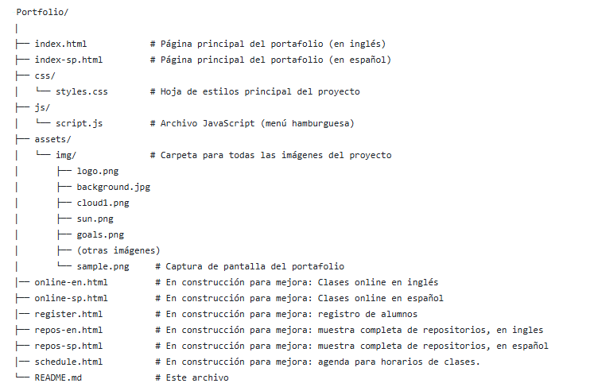

## Portafolio Personal de Alejandra Lorena Rachich

Este proyecto es la implementación de la Práctica Formativa del curso de Desarrollo web FrontEnd, perteneciente a la currícula de la Tecnicatura Superior en Desarrollo de Software, del IFTS N°29 de CABA, que consistió en el desarrollo de un portafolio personal. El objetivo principal fue reforzar habilidades de desarrollo frontend, aplicando buenas prácticas de diseño y responsividad.

Puede verse una versión en vivo de este portafolio aquí:
 https://Alexa-2k.github.io/Personal-Portfolio
 
 
## Características Principales
* **CSS Limpio y Estructurado:**
    * Uso de **variables CSS (`:root`)** para una gestión eficiente de colores, tipografías y espaciados.
    * Aplicación de **Flexbox** 
    * Manejo de **Box Model** (márgenes, paddings, bordes).
    * Control de elementos en bloque y en línea, **evitando el uso de ` `**.
    * **Combinadores CSS** (`>`, ` `) para una selección de elementos precisa y una mejor organización del código.
    * **Pseudoclases (`:hover`, `:active`)** en enlaces y botones para una mejor interactividad.
    * Implementación de **estilos personalizados para tablas** (filas pares/impares, hover).
    * Uso de **`z-index`** para el control de la superposición de elementos.
    * **Animaciones y Transiciones:** Inclusión de transiciones suaves en imágenes y enlaces/botones para una experiencia de usuario más dinámica.
* **Uso de Iconos:** Integración de íconos para mejorar la usabilidad y estética.

**Responsividad :** Diseño adaptativo cubriendo los siguientes breakpoints:
    * Desktop / Tablet Horizontal (`max-width: 1080px`)
    * Tablet Vertical (`max-width: 768px`)
    * Mobile 1 (`max-width: 480px`)
    * Mobile 2 (`max-width: 375px`)
    
## Tecnologías Utilizadas

* **HTML5:** Estructura semántica del contenido.
* **CSS3:** Estilado y responsividad (con enfoque en CSS puro).
* **Google Fonts:** Tipografías personalizadas (`Merriweather`, `Montserrat`, `Sacramento`).
* **Font Awesome:** Biblioteca de íconos.
* **Animate.css:** Para animaciones de elementos en la carga inicial.
* **(Opcional) JavaScript:** Utilizado para la funcionalidad del menú hamburguesa (mostrar/ocultar).

## 📂 Estructura del Proyecto

## Muestra del Portafolio

